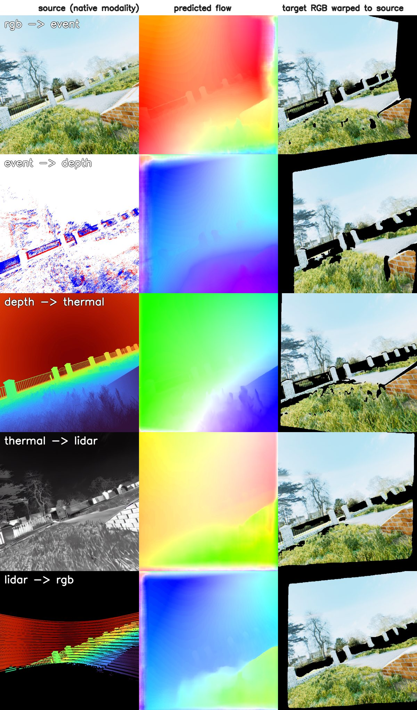

# TartanMatch: Towards Universal Dense Correspondence Across Modalities

[**Project page**](https://tartanmatch.github.io/) | **arXiv** (coming soon) | [**Weights**](https://huggingface.co/theairlabcmu/TartanMatch)

Hyeokjoon Kwon\*, Jiting Cai\*†, Ruogu Li\*, Kritan Bhandari, Geethika Hemkumar, Parv Maheshwari, Yuheng Qiu,
Yuchen Zhang, Sebastian Scherer, Wenshan Wang

\* Equal contribution; the order of the first three authors was chosen randomly. † Corresponding author.

Dense correspondence between any two views captured in **RGB, depth, thermal, LiDAR, or event** modalities.
Given a source view and a target view (same or different modality), TartanMatch predicts, for every source
pixel, the matching target pixel (optical flow) and the probability that the pixel is visible in the target
(covisibility).

TartanMatch is the multimodal successor of [UFM](https://uniflowmatch.github.io/): a shared DINOv2 encoder,
a multi-view global-attention transformer, and DPT heads. Each non-RGB modality is mapped into the encoder's
image space by a small learned projection, so a single network serves all 25 modality pairs.

## Installation

```bash
git clone https://github.com/castacks/tartanmatch.git
cd tartanmatch
pip install -e .            # core: torch, numpy, safetensors, huggingface_hub
pip install -e ".[demo]"    # adds opencv-python, matplotlib for the example script
```

The DINOv2 architecture definition is fetched once from `facebookresearch/dinov2` through `torch.hub`
(code only; no DINOv2 weights are downloaded because the TartanMatch checkpoint already contains the
fine-tuned encoder).

## Checkpoint

| Name | Description | Params |
|---|---|---|
| `tartanmatch_v1.safetensors` | All-modality model, ViT-L/14 encoder, 420x560 inference resolution | 428.3M |

The weights are hosted on Hugging Face at [`theairlabcmu/TartanMatch`](https://huggingface.co/theairlabcmu/TartanMatch).
Either pass the repo id directly, which downloads and caches the file:

```python
model = TartanMatch.from_pretrained("theairlabcmu/TartanMatch", device="cuda")
```

or download `tartanmatch_v1.safetensors` manually into `checkpoints/` and pass the local path, as the
examples below do.

## Quick start

```python
import cv2, numpy as np
from tartanmatch import TartanMatch

model = TartanMatch.from_pretrained("checkpoints/tartanmatch_v1.safetensors", device="cuda")

asset = "examples/assets/oldbrickhouseday"
rgb = cv2.cvtColor(cv2.imread(f"{asset}/rgb.png"), cv2.COLOR_BGR2RGB).transpose(2, 0, 1)  # (3, H, W) uint8
events = np.load(f"{asset}/events.npy")  # (N, 4) raw events [t, x, y, polarity]

out = model.predict(rgb, "rgb", events, "event", event_resolution=(640, 640))
flow = out.flow[0]                 # (2, H, W): target pixel = source pixel + flow
covisibility = out.covisibility[0] # (H, W) in [0, 1]
```

Any of the five modalities can be the source or the target; see [`examples/README.md`](examples/README.md)
for loading each one. `predict` accepts arbitrary (and different)
source / target sizes; inputs are resized to the model resolution internally and the flow is returned in
the original pixel units of the source and target images.

### Input formats

| Modality | Format passed to `predict` |
|---|---|
| `rgb` | `(3, H, W)` uint8, or float in [0, 1] |
| `thermal` | `(3, H, W)` uint8 (grayscale thermal replicated or false-colour), or float in [0, 1] |
| `depth` | `(1, H, W)` float32 metric depth, 0 where invalid |
| `lidar` | `(1, H, W)` float32 LiDAR depth projected into the camera, 0 where there is no return |
| `event` | `(15, H, W)` float32 voxel grid, **or** raw events `(N, 4)` float `[timestamp, x, y, polarity]` with `event_resolution=(H, W)` |

A leading batch dimension is optional for every modality. Depth and LiDAR are normalized per sample
(percentile-scaled log depth), so any consistent metric unit works. Raw events are voxelized with
`tartanmatch.preprocess.events_to_voxel_grid` (trilinear splatting into 15 temporal bins).

## Examples

`examples/assets/oldbrickhouseday/` holds five consecutive frames of one TartanAir-V2 trajectory, each in a
different modality, so every pair of frames is a cross-modal matching problem. See
[`examples/README.md`](examples/README.md) for how each modality is loaded.

```bash
python examples/demo.py --checkpoint checkpoints/tartanmatch_v1.safetensors                    # rgb→event, event→depth, depth→thermal, thermal→lidar, lidar→rgb
python examples/demo.py --checkpoint checkpoints/tartanmatch_v1.safetensors --all              # all 20 cross-modality pairs
python examples/demo.py --checkpoint checkpoints/tartanmatch_v1.safetensors --pairs rgb:lidar event:thermal
```

Each pair produces `examples/outputs/<source>_to_<target>.png`: the source view in its native modality, colour-coded flow, and the
target frame warped into the source frame (black where the model predicts the pixel is not covisible).
Reference panels for the default pairs are in [`examples/expected_outputs/`](examples/expected_outputs/).



## Tests

```bash
pytest tests
```

## License

The code is released under the [BSD-3-Clause license](LICENSE). The model weights inherit the licenses of
the training datasets and are released under [CC BY-NC-SA 4.0](https://creativecommons.org/licenses/by-nc-sa/4.0/);
they may not be used for commercial purposes.

## Acknowledgements

This work was supported by the Defense Science and Technology Agency (DSTA) Contract #DST000EC124000205.
The compute for this work was provided by Bridges-2 at PSC through allocation cis220039p from the Advanced
Cyberinfrastructure Coordination Ecosystem: Services & Support (ACCESS) program, which is supported by NSF grants
#2138259, #2138286, #2138307, #2137603, and #2138296.

TartanMatch builds on [UFM](https://github.com/UniFlowMatch/UFM), [UniCeption](https://github.com/castacks/UniCeption),
[DINOv2](https://github.com/facebookresearch/dinov2), and [DUSt3R](https://github.com/naver/dust3r).

## Citation

If you use TartanMatch, please cite:

```bibtex
@article{kwon2026tartanmatch,
 title={TartanMatch: Towards Universal Dense Correspondence Across Modalities},
 author={Kwon, Hyeokjoon and Cai, Jiting and Li, Ruogu and Bhandari, Kritan and Hemkumar, Geethika and Maheshwari, Parv and Qiu, Yuheng and Zhang, Yuchen and Scherer, Sebastian and Wang, Wenshan},
 journal={arXiv preprint},
 year={2026}
}
```

TartanMatch builds on UFM; please consider citing it as well:

```bibtex
@article{zhang2025ufm,
 title={UFM: A Simple Path towards Unified Dense Correspondence with Flow},
 author={Zhang, Yuchen and Keetha, Nikhil and Lyu, Chenwei and Jhamb, Bhuvan and Chen, Yutian and Qiu, Yuheng and Karhade, Jay and Jha, Shreyas and Hu, Yaoyu and Ramanan, Deva and Scherer, Sebastian and Wang, Wenshan},
 journal={arXiv preprint arXiv:2506.09278},
 year={2025}
}
```
