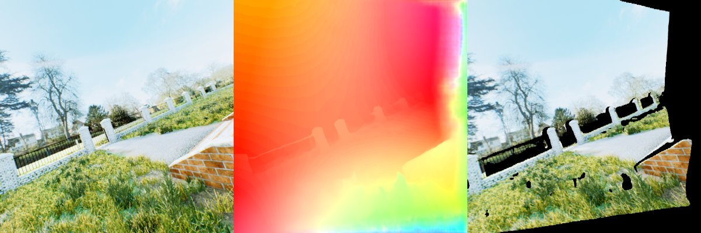
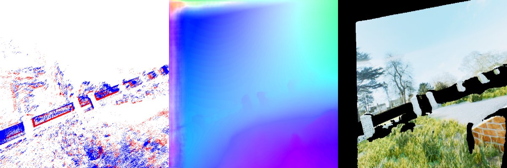
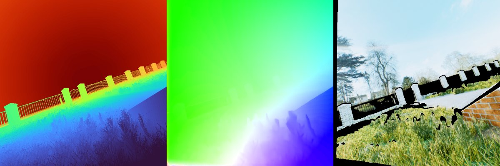
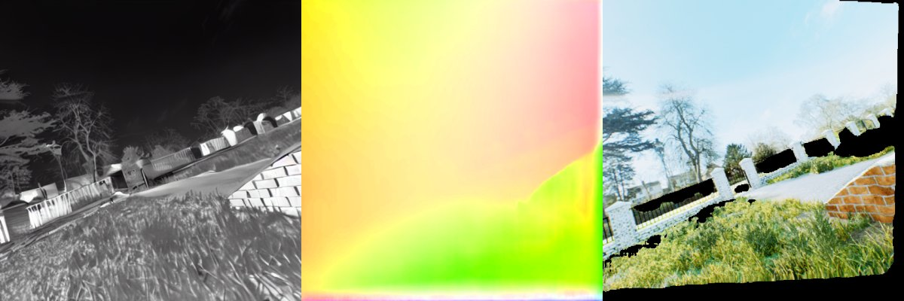
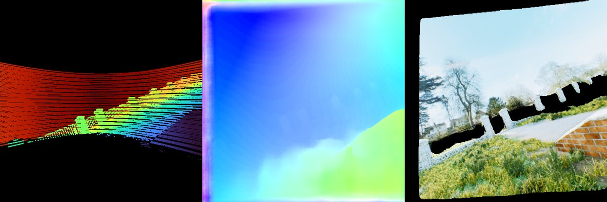

# Examples

`assets/oldbrickhouseday/` contains five consecutive frames (stride 3) of the TartanAir-V2 trajectory
`OldBrickHouseDay/Data_easy/P004`, each provided in a different modality so that any pair of frames is a
cross-modal matching problem with real camera motion between them:

| File | Modality | Frame | Format |
|---|---|---|---|
| `rgb.png` | rgb | 694 | 640x640 RGB, 8-bit |
| `depth.npy` | depth | 697 | `(640, 640)` float32 metric depth in metres |
| `thermal.png` | thermal | 700 | 640x640 simulated thermal image, 8-bit, 3 channels |
| `lidar.npy` | lidar | 703 | `(640, 640)` float32 LiDAR depth projected into the camera; 0 where there is no return (~11% of pixels hit) |
| `events.npy` | event | 706 | `(N, 4)` float32 raw events `[timestamp, x, y, polarity]` between frames 706 and 707 |
| `frame_rgb_<modality>.png` | – | as above | RGB render of that frame, for visualisation only |

## Loading each modality

Every modality is passed to `TartanMatch.predict` as an array with a leading channel dimension
(a batch dimension is optional):

```python
import cv2, numpy as np
from tartanmatch import TartanMatch

asset = "examples/assets/oldbrickhouseday"
read_rgb = lambda name: cv2.cvtColor(cv2.imread(f"{asset}/{name}"), cv2.COLOR_BGR2RGB).transpose(2, 0, 1)

inputs = {
    "rgb": read_rgb("rgb.png"),                   # (3, H, W) uint8
    "thermal": read_rgb("thermal.png"),           # (3, H, W) uint8
    "depth": np.load(f"{asset}/depth.npy")[None], # (1, H, W) float32 metres
    "lidar": np.load(f"{asset}/lidar.npy")[None], # (1, H, W) float32 metres, 0 = no return
    "event": np.load(f"{asset}/events.npy"),      # (N, 4) raw events; voxelized inside predict
}

model = TartanMatch.from_pretrained("checkpoints/tartanmatch_v1.safetensors", device="cuda")
```

Any two entries can be matched in either direction; pass `event_resolution=(H, W)` whenever raw events are used:

```python
rgb_to_event = model.predict(inputs["rgb"], "rgb", inputs["event"], "event", event_resolution=(640, 640))
lidar_to_thermal = model.predict(inputs["lidar"], "lidar", inputs["thermal"], "thermal")
event_to_depth = model.predict(inputs["event"], "event", inputs["depth"], "depth", event_resolution=(640, 640))
```

Each result has `.flow[0]`, a `(2, H, W)` tensor where source pixel `(x, y)` matches target pixel
`(x + flow[0], y + flow[1])`, and `.covisibility[0]`, an `(H, W)` tensor in `[0, 1]`.

If you already have an event voxel grid, pass it as a `(15, H, W)` float32 array instead of raw events; the
conversion used internally is `tartanmatch.preprocess.events_to_voxel_grid`.

## Demo script

```bash
python examples/demo.py --checkpoint checkpoints/tartanmatch_v1.safetensors            # curated pairs
python examples/demo.py --checkpoint checkpoints/tartanmatch_v1.safetensors --all      # all 20 pairs
python examples/demo.py --checkpoint checkpoints/tartanmatch_v1.safetensors --pairs rgb:event lidar:thermal depth:event
```

The curated set is `rgb→event`, `event→depth`, `depth→thermal`, `thermal→lidar`, `lidar→rgb`, so every modality
is exercised as both source and target. Each run writes `examples/outputs/<source>_to_<target>.png`:
source view in its native modality | colour-coded flow | target RGB warped into the source frame (black where the model predicts
the source pixel is not visible in the target).

## Expected results

`expected_outputs/` holds downscaled panels from the default run (source in its native modality | predicted
flow | target RGB warped into the source frame, black = predicted not covisible). Your `examples/outputs/`
should look the same up to float16 rounding.

| pair | expected panel |
|---|---|
| rgb → event |  |
| event → depth |  |
| depth → thermal |  |
| thermal → lidar |  |
| lidar → rgb |  |
